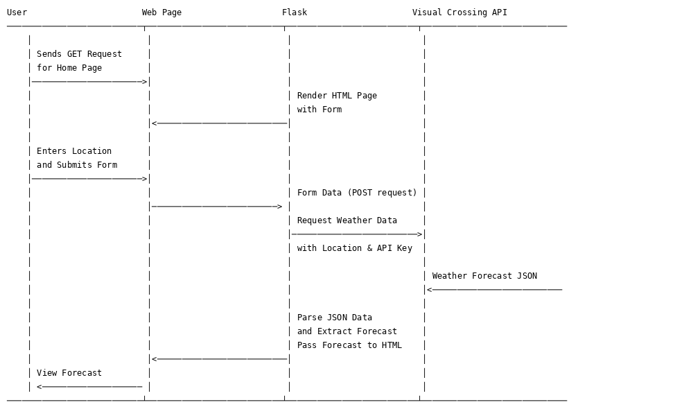

# Weather Forecast Application

A simple web page that retrieves weather data for the next 7 days for a given location.

## Application Flow


## Prerequisites

1. **API Key**: Sign up at [Visual Crossing API](https://www.visualcrossing.com/) and obtain an API key.
2. **Python and Pip**: Ensure Python and Pip are installed on your machine.
3. **Dependencies**: Install the required modules listed in the `requirements.txt` file:
   ```bash
   pip install -r requirements.txt
   ```

## Run the Application

You have two options to run the app:

1. **Docker**:
   - Build the Docker image:
     ```bash
     docker build -t weather-forecast-app .
     ```
   - Run the Docker container:
     ```bash
     docker run -p 5000:5000 weather-forecast-app
     ```
   - Access the app in your browser at `http://localhost:5000`.

2. **Direct Execution**:
   - Run `weather.py` directly:
     ```bash
     python weather.py
     ```
   - Access the app in your browser at `http://localhost:5000`.
